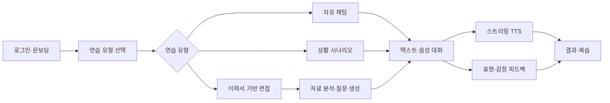

# K-Manner Speech Frontend

> 관계와 상황에 맞는 한국어 표현을 AI 페르소나와 연습하는 React 웹 애플리케이션

[백엔드 저장소](https://github.com/K-manner-speech/k-manner-speech-advanced-api) · [API 문서](https://github.com/K-manner-speech/k-manner-speech-advanced-api/blob/develop/docs/API%EB%AA%85%EC%84%B8.md) · [솔루션 아키텍처](https://github.com/K-manner-speech/k-manner-speech-advanced-api/blob/develop/docs/%EC%95%84%ED%82%A4%ED%85%8D%EC%B2%98.md)

## 프로젝트 소개

K-Manner Speech는 외국인 한국어 학습자가 문법뿐 아니라 **상대방과의 관계·상황·목적에 맞는 표현과 매너**를 연습하도록 돕는 AI 회화 학습 서비스입니다.

사용자는 AI 페르소나와 자유 대화 또는 상황 시나리오를 진행하고, 텍스트와 음성으로 말하며 표현 피드백과 감정·인상 추정을 확인할 수 있습니다. 이력서 기반 면접에서는 자료를 등록하고 맞춤 질문에 답한 뒤 항목별 평가와 개선 제안을 복습합니다.

이 저장소는 FastAPI가 제공하는 제품 상태와 AI 처리 결과를 사용자가 이해하고 다시 행동할 수 있는 화면으로 연결합니다. 브라우저는 로그인에만 Supabase Auth를 직접 사용하며 애플리케이션 데이터는 모두 FastAPI를 통해 접근합니다.

## 주요 사용자 흐름



## 주요 기능

| 영역 | 기능 |
| --- | --- |
| 인증·온보딩 | 이메일 가입·로그인, 프로필과 표시 언어 설정, 보호 route |
| 홈 | 출석, 연속 학습, 오늘의 추천과 진행 중 연습 진입 |
| 연습 | 자유 채팅, 상황 시나리오, 이력서 기반 면접 준비 |
| 대화 | 텍스트·음성 입력, 처리 상태 표시, 대화 이어하기 |
| 음성 재생 | PCM 스트리밍 선재생, 완성 음성 fallback, 다시 듣기 |
| 결과 | 종합 평가, 항목별 점수, 강점·보완점과 근거 복습 |
| 계정 | 프로필·언어·비밀번호 변경과 회원 탈퇴 |

표시 언어를 English로 선택하면 내비게이션, 홈, 연습 선택과 면접 준비 안내가 영어로 바뀝니다. 실제 대화와 피드백은 한국어 학습 맥락을 위해 한국어로 유지합니다.

## 프론트엔드 구조와 상태 관리

```text
src/
├── app/          # Router와 전역 Provider 조립
├── features/     # auth, home, practice, conversation, interview, results, account
├── components/   # 도메인과 분리된 UI·shell
├── api/          # HTTP client, Supabase Auth, OpenAPI 생성 타입
├── store/        # 언어·TTS 등 client-only 상태
├── i18n/         # 한국어·영어 리소스
├── lib/          # 날짜·멱등 key·환경변수
└── test/         # 공통 테스트 설정
```

- **TanStack Query**는 API 응답, polling, cache와 invalidation 등 서버 상태를 관리합니다.
- **Zustand**는 표시 언어와 음성 재생 설정처럼 서버 데이터가 아닌 사용자 환경 상태만 관리합니다.
- **React Hook Form + Zod**는 즉시 확인할 수 있는 폼 오류를 처리하고 최종 제품 검증은 FastAPI 응답을 기준으로 합니다.
- **CSS Modules**는 feature와 component 스타일을 격리하고 전역 CSS custom properties를 디자인 토큰으로 사용합니다.
- Route guard는 인증과 온보딩 상태에 맞는 화면을 선택하지만 데이터 소유권과 제품 상태의 최종 판단은 서버에 맡깁니다.

## 핵심 기술 선택과 문제 해결

### OpenAPI에서 TypeScript 타입 생성

- **문제:** API와 프론트 타입을 각각 수정하면 필드나 endpoint 변경이 런타임 오류로 이어질 수 있습니다.
- **결정:** FastAPI의 고정 `openapi.json`에서 타입을 생성하고 `openapi-fetch`로 실제 요청까지 연결했습니다.
- **검증:** 생성 타입을 직접 수정하지 않으며 contract check, typecheck와 build로 계약 불일치를 확인합니다.

### TTS 스트리밍과 완성 음성 fallback

- **문제:** 완성 음성만 기다리면 첫 재생이 느리고 스트림만 재생하면 중단 이후 복구하기 어렵습니다.
- **결정:** `s16le` 24kHz mono PCM을 AudioWorklet으로 먼저 재생하고, 스트림이 실패하거나 짧게 끝나면 완성 음성의 남은 구간으로 전환합니다.
- **결과:** 빠른 첫 재생과 안정적인 다시 듣기를 함께 제공하며 buffer 정책은 `STREAMING_TTS_BUFFER_POLICY`에서 관리합니다.

### AI 작업의 부분 성공 표현

- **문제:** 대화 텍스트, 감정 분석, 피드백과 음성은 서로 다른 시점에 완료되거나 일부만 실패할 수 있습니다.
- **결정:** 하나의 전역 loading 상태로 묶지 않고 리소스별 processing·success·failure 상태를 polling하며 가능한 텍스트 결과와 재시도 경로를 유지합니다.
- **결과:** TTS가 늦거나 실패해도 사용자는 대화를 읽고 계속 연습할 수 있습니다.

### 서버 상태와 사용자 환경 상태 분리

서버 상태는 TanStack Query, 언어·TTS 설정 등 client-only 상태는 Zustand로 나누어 API 재조회와 사용자 설정의 생명주기가 서로 영향을 덜 주도록 구성했습니다.

## 기술 스택

| 구분 | 기술 |
| --- | --- |
| UI | React 19, TypeScript, Vite |
| Routing | React Router |
| State | TanStack Query, Zustand |
| Form | React Hook Form, Zod |
| API contract | openapi-typescript, openapi-fetch |
| Auth·i18n | Supabase Auth, i18next |
| Test | Vitest, Testing Library, MSW, Playwright |
| Quality | Oxlint, TypeScript compiler |

## 빠른 시작

`.env.example`을 `.env.local`로 복사하고 공개 가능한 값만 입력합니다.

```dotenv
VITE_API_BASE_URL=http://127.0.0.1:8010
VITE_SUPABASE_URL=https://<project-ref>.supabase.co
VITE_SUPABASE_ANON_KEY=<publishable-or-anon-key>
```

Service role key, DB URL, Gemini/OpenAI API key는 프론트 환경에 넣지 않습니다.

```bash
npm install
npm run dev
```

`http://localhost:5173/login`을 엽니다. IPv4 주소를 사용하려면 `npm run dev -- --host 127.0.0.1`로 실행하고 한 로그인 세션에서 `localhost`와 `127.0.0.1`을 섞지 않습니다.

전체 AI 기능을 사용하려면 백엔드 API와 `conversation_text`, `interactive_ai`, `evaluation_ai`, `document_analysis` Worker가 실행 중이어야 합니다.

## 검증

```bash
npm run lint
npm run typecheck
npm run test
npm run contract-check
npm run build
npm run e2e
```

실제 Supabase 로그인 E2E는 `.env.test.example`을 `.env.test`로 복사하고 테스트 계정과 Supabase 설정을 입력한 뒤 실행합니다. `.env.test`는 Git에서 제외됩니다.

## OpenAPI 계약 동기화

`openapi.json`은 FastAPI `/openapi.json`에서 고정한 artifact입니다. API 변경 후 다음을 실행합니다.

```bash
npm run openapi:generate
npm run contract-check
```

생성 결과인 `src/api/generated/schema.d.ts`는 직접 수정하지 않습니다.

## 주요 라우트

| 경로 | 화면 |
| --- | --- |
| `/start`, `/login`, `/signup` | 시작·로그인·회원가입 |
| `/onboarding` | 프로필·언어 온보딩 |
| `/` | 홈과 오늘의 추천 |
| `/practice` | 연습 유형·페르소나·시나리오 선택 |
| `/rooms`, `/rooms/:roomId` | 대화방 목록·대화·면접 진행 |
| `/interview` | 면접 자료 업로드와 구성 |
| `/results`, `/results/:resultId` | 결과 목록·상세 |
| `/results/:resultId/scores` | 항목별 점수 |
| `/results/:resultId/strengths[/:key]` | 강점 목록·상세 |
| `/results/:resultId/improvements[/:key]` | 보완점 목록·상세 |
| `/me`, `/me/edit`, `/me/security` | 내 정보·프로필·보안 설정 |

라우트의 단일 기준은 `src/app/router.tsx`입니다. 대화 화면에서는 하단 내비게이션을 숨기며 화면을 나가도 연습을 종료하지 않고 목록에서 이어갈 수 있습니다.

## 실시간 TTS 동작

1. `GET /api/v1/messages/{message_id}/audio/stream`에서 생성 중 PCM을 받습니다.
2. 최초 1초 분량을 buffer한 뒤 AudioWorklet으로 재생합니다.
3. underrun이 발생하면 0.5초 분량을 다시 모아 이어서 재생합니다.
4. 스트림이 실패하면 완성 음성 endpoint로 전환합니다.
5. 이미 재생한 구간은 건너뛰고 남은 부분만 재생합니다.

관련 구현은 `src/features/conversation/ttsStreaming.ts`, `audioPlayback.ts`에 있습니다.

## 브랜치 전략

`develop`에서 `feature/*` 브랜치를 만들고 Pull Request로 병합합니다. `main`에는 직접 커밋하지 않습니다.
